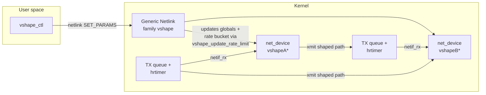
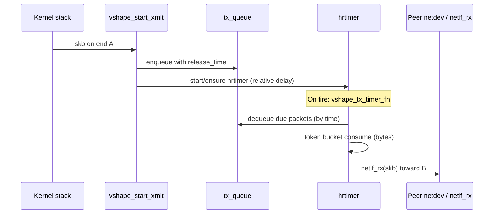

# vnet-shape — Architecture

This document describes how the **vnet-shape** project is structured, how traffic flows through the kernel module, and how user space configures it. It complements the [README](../README.md).

## Purpose

**vnet-shape** implements a **pair of virtual Ethernet devices** (`vshapeA*` / `vshapeB*`) connected back-to-back in software. Anything transmitted on one device is optionally delayed, jittered, dropped, and rate-limited before being delivered to the peer’s receive path—similar in spirit to a **veth pair**, but with **emulated WAN conditions** for demos and testing.

There is **no physical hardware**; all buffering and timing happen in RAM using the kernel networking APIs.

---

## Repository layout

| Path | Role |
|------|------|
| `kernel/vnet_shape.c` | Core driver: `net_device` pair, queues, `hrtimer`, token bucket, `ndo_start_xmit`, statistics. |
| `kernel/vshape_nl.c` | Generic Netlink family: runtime parameter updates from user space. |
| `kernel/netlink.h` | Shared Genl name, command, and attribute IDs (included by kernel and `vshape_ctl`). |
| `kernel/Makefile` | Out-of-tree build: produces **`vshape_mod.ko`** from `vnet_shape.o` + `vshape_nl.o`. |
| `userspace/vshape_ctl.c` | CLI using libnl to send `SET_PARAMS` commands. |
| `userspace/Makefile` | Builds `vshape_ctl` against libnl. |
| `tests/test_rate_limit_udp.sh` | Optional integration test (namespaces, iperf3, module load). |

Top-level `Makefile` delegates to `kernel/` and `userspace/`.

---

## Logical architecture

- Each **end** has its own **transmit queue** and **high-resolution timer**. Traffic sent on **A** is shaped on **A**’s private state and delivered to **B**; the symmetric path applies for **B** → **A**.
- **Generic Netlink** only adjusts **global** module parameters (delay, jitter, loss, rate). It does not carry per-packet data.

---

## Device model

### Paired interfaces

On module load, two `net_device` instances are allocated and registered with names like **`vshapeA0`** and **`vshapeB0`** (the suffix is chosen by the kernel’s `%d` allocation).

- `struct vshape_priv` (per device) holds:
  - Pointers to **`dev`** (this end) and **`peer`** (the other end).
  - **`tx_queue`**: a linked list of `struct vshape_qitem` (skb + `release_time`).
  - **`queue_lock`**: spinlock protecting the queue, queue length, and timer scheduling decisions that touch the queue.
  - **`tx_timer`**: `hrtimer` in **relative** mode; drives dequeue when simulated delay has elapsed.
  - **Token bucket** fields: `rate_bytes_per_ms`, `bucket_capacity_bytes`, `bucket_tokens`, `last_bucket_update`.
  - **Statistics** protected with `u64_stats_sync` for 64-bit counters on 32-bit kernels.

There is **one pair per module load**; the module does not create multiple independent pairs.

---

## Data path (shaping enabled, `param_passthrough = false`)

### 1. Transmit (`ndo_start_xmit`)

Rough order of operations:

1. **Peer up check** — If there is no peer or the peer is not `IFF_UP`, the skb is dropped and `tx_dropped` is incremented.
2. **Random loss** — Before queuing, a Bernoulli trial using **`param_loss_ppm`** (parts per million) may drop the packet.
3. **Queue cap** — If `queue_len >= param_max_queue`, the packet is dropped (safety valve).
4. **Delay + jitter** — Release time is `now + param_delay_ms + jitter`, where jitter is uniform in `[-param_jitter_ms, +param_jitter_ms]` (or zero if jitter is 0).
5. **Enqueue** — skb is wrapped in `vshape_qitem`, appended to `tx_queue`, `queue_len` incremented, `tx_packets` / `tx_bytes` updated.
6. **Timer** — If the per-end `hrtimer` is not already queued, it is started with **`HRTIMER_MODE_REL`** and an expiry of the **same delay** as this packet’s first release (so the timer wakes around when the earliest queued packet may leave).

### 2. Timer callback (`vshape_tx_timer_fn`)

Runs in **softirq / hrtimer context** (not process context):

1. If **`peer`** is unexpectedly `NULL`, the queue is drained and skbs freed (defensive).
2. While the head of the queue has **`release_time <= now`**:
   - **Token bucket** — `vshape_bucket_consume()` deducts bytes equal to the skb length. If not enough tokens, dequeue **stops** (packet stays queued; timer will retry on next wake).
   - The item is removed from the list; **`netif_rx()`** is invoked on the **peer** device with `eth_type_trans()` applied.
   - **Peer RX stats** (`rx_packets`, `rx_bytes`) are updated on the peer’s `vshape_priv`.
3. If the queue still has entries, the timer is **forwarded** by **1 ms** and **restarted**; otherwise it **does not** restart until new work enqueues another timer start from xmit.

So the timer is **not** strictly “every 1 ms globally”; it uses **1 ms steps** once running to revisit the queue when rate limiting or ordering requires it, and initial timing follows the configured delay.

### 3. Token bucket

- **`param_rate_kbps == 0`** means **unlimited**: the bucket always allows consumption.
- Otherwise, **`rate_bytes_per_ms`** is derived from kbps (kilobits per second → bytes per millisecond, with a minimum of 1 byte/ms to avoid a zero rate).
- **`param_burst_ms`** scales **bucket capacity** (`rate_bytes_per_ms * burst_ms`). Tokens refill based on elapsed time since `last_bucket_update`, capped at capacity.
- **Consumption** happens **at dequeue** (when delivering to the peer), not at enqueue—so delay and loss can precede bandwidth limiting in the pipeline.
- **`param_max_timer_packets`** caps how many queued packets **`netif_rx()`** may run per timer tick (default 64). Without a cap, a UDP flood can spend milliseconds in one timer callback and stall some virtualized guests.

Updates from **`vshape_update_rate_limit()`** (called when rate changes via Netlink) recalculate bucket parameters under the queue lock and reset tokens/capacity consistently for both ends.

### 4. Passthrough (`param_passthrough = true`)

Shaping queues are bypassed: after the peer-up and loss checks, the skb is passed immediately to **`netif_rx()`** on the peer with stats updated. The timer is unused for that path.

---

## User space: Generic Netlink

- **Family name:** `vshape` (see `VSHAPE_GENL_NAME` in `kernel/netlink.h`).
- **Command:** `VSHAPE_CMD_SET_PARAMS` with optional attributes:
  - `VSHAPE_ATTR_DELAY_MS`, `VSHAPE_ATTR_JITTER_MS`, `VSHAPE_ATTR_LOSS_PPM`, `VSHAPE_ATTR_RATE_KBPS` (all `u32`).

The handler in `vshape_nl.c` assigns **module-global** `param_*` variables. Changing **rate** also calls **`vshape_update_rate_limit()`** so per-device buckets update immediately.

**Not** exposed via Netlink today: `param_burst_ms`, `param_passthrough`, `param_max_queue`, `param_max_timer_packets`, `param_debug`—those remain **module parameters** only (`insmod` / `/sys/module/.../parameters/`).

`vshape_ctl` builds a Genl message with **one** attribute per invocation (e.g. `vshape_ctl set delay 50`).

---

## Concurrency

- **`queue_lock`** protects each end’s queue, length, and coordination with **`hrtimer_start`** / whether the timer is queued for that end’s queue.
- **Global `param_*`** (delay, jitter, loss) are read on transmit and in the timer **without** explicit locking; for a demo module this is usually acceptable, but updates from Netlink can race with packet processing on other CPUs.
- **Statistics** use **`u64_stats_sync`** on each `vshape_priv` for correct 64-bit reads from user space (`ndo_get_stats64`).

---

## Module parameters (summary)

| Parameter | Meaning |
|-----------|---------|
| `param_delay_ms` | Base one-way delay before dequeue (milliseconds). |
| `param_jitter_ms` | Uniform jitter range ± around delay (milliseconds). |
| `param_loss_ppm` | Drop probability before enqueue, in parts per million (0–1,000,000). |
| `param_rate_kbps` | Shaped rate in **kilobits per second**; `0` = unlimited. |
| `param_burst_ms` | Token bucket capacity in milliseconds of sustained rate. |
| `param_passthrough` | If true, skip queues/timer and deliver immediately (still subject to loss check as implemented). |
| `param_max_queue` | Maximum queued skbs per end (drops beyond this). |
| `param_max_timer_packets` | Max **`netif_rx()`** calls per hrtimer tick (`0` = unlimited; default 64). |
| `param_debug` | Reserved for optional verbose logging when built with `VNET_SHAPE_DEBUG`. |

---

## Testing

- **`tests/test_rate_limit_udp.sh`** loads **`vshape_mod.ko`**, moves **`vshapeA0` / `vshapeB0`** into network namespaces, assigns addresses, and runs **iperf3** UDP to exercise rate limiting. See script header for options.

---

## Design limitations (intentional scope)

- Single **fixed pair** per load; no dynamic creation of many pairs from user space.
- **Global** shaping parameters (not per-flow or per-socket).
- **Coarse** token refill (millisecond granularity) for simplicity.

These tradeoffs keep the codebase small and suitable for learning and demos; production-grade traffic control is typically done with **tc** / **qdiscs** or XDP on real interfaces.

---

## See also

- [README](../README.md) — build, load, and basic usage.
- Kernel sources: `kernel/vnet_shape.c`, `kernel/vshape_nl.c`.
